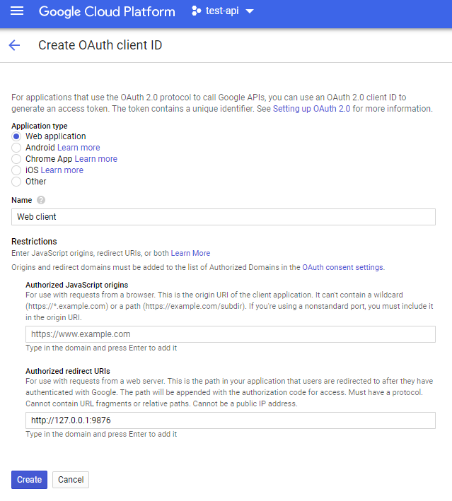
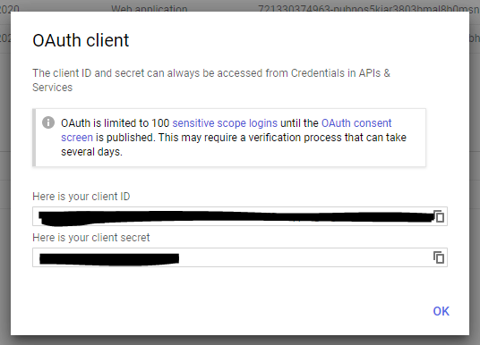
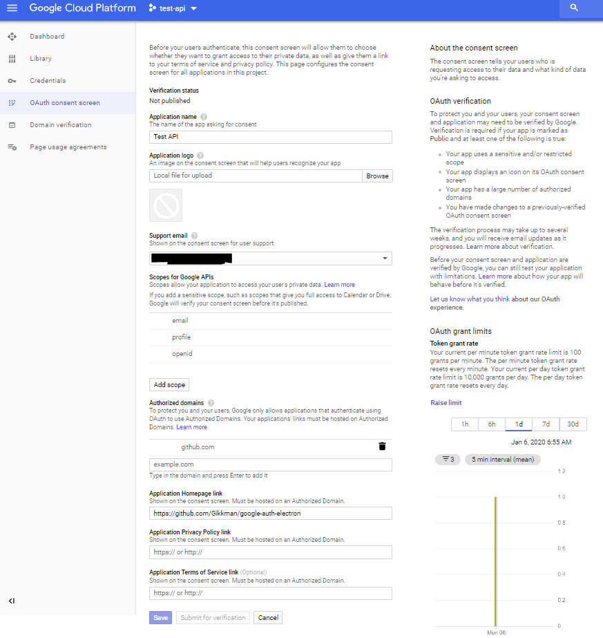

# google-auth-electron
Sample app for verifying against Google. This repo is based of the article [Google Auth in Electron - Authenticating with Google OAuth2 with a file-based origin](https://blog.ecliptic.io/google-auth-in-electron-a47b773940ae) and on [Google's own example](https://developers.google.com/sheets/api/quickstart/nodejs) but has some tweeks of my own.

The example allows you to either authenticate using a new Electron BrowserWindow, or to authenticate using the OS default browser

# Getting Credentials
The procedure is documented by google here: [Using OAuth 2.0 for Mobile and Desktop Applications](https://developers.google.com/identity/protocols/OAuth2InstalledApp)

To get started, visit the [Google Cloud Console](https://console.cloud.google.com/) and set up a project if you don’t have one already. Navigate to the API Manager section, and the Credentials tab. Click on “Create Credentials”, and select “OAuth Client ID”. Under `Application Type`, chose Web Application (I know it is strange, but just roll with it).

After creating credentials, you will see a popup with some client information:

Close the popup, and istead download the credentials as a JSON, and store those credentials in your application path.

# Conscent Screen
Google might require that you fill out a conscent screen. If you are prompted to fill it out, you'll have to jump through some hoops. But fill it out the best you can and save it. You will need to go back and fix this screen later on if you want to get rid of Google's "This app is not approved" warning upon login, but for testing this will work.

